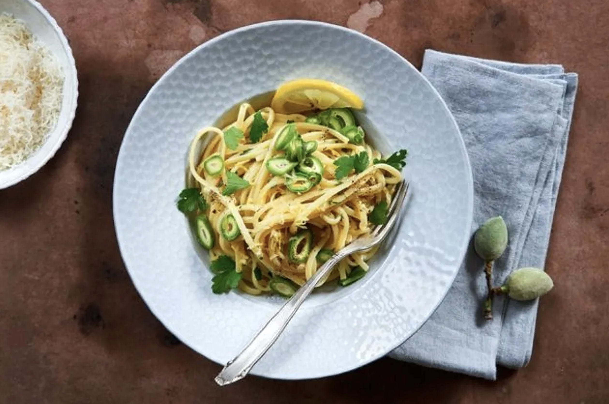

### Zutaten (Vier Personen):

- 500 g Spaghetti
- 1  erstklassige Bio-Zitrone
- 500 ml Hühner- oder Gemüsebrühe
- 2  Eier

- 80 g Parmesan
- 1 Bund Petersilie
- 2 EL kalte Butter

Spaghetti in reichlich Salzwasser kochen. Gleichzeitig die Schale einer saftigen Bio-Zitrone fein abreiben. Den Saft auspressen und mit 450 ml Hühner- oder Gemüsebrühe um die Hälfte einkochen. Parmesan reiben, mit restlicher Brühe und 2 Eiern verquirlen. Die Blättchen von 1 Bund Petersilie zupfen und hacken. Mit 2 EL Butter und der Zitronenschale unter die eingekochte Brühe rühren. Spaghetti abgiessen, kurz abtropfen und dann gleich mit Brühe und Parmesan-Eier-Mischung vermengen, bis alle Nudeln von einer cremigen Emulsion überzogen sind. Sofort servieren.

Grüne Mandel-Variante:  
Wer vergangene Woche mit uns grüne Mandeln eingelegt hat, kann die jetzt bestens verwenden um die Zitronenspaghetti noch weiter zu verfeinern: 2 EL von der Einlegeflüssigkeit zusammen mit der Hühnerbrühe einkochen. 12 eingelegte Mandeln dünn schneiden, über die fertigen Nudeln streuen.