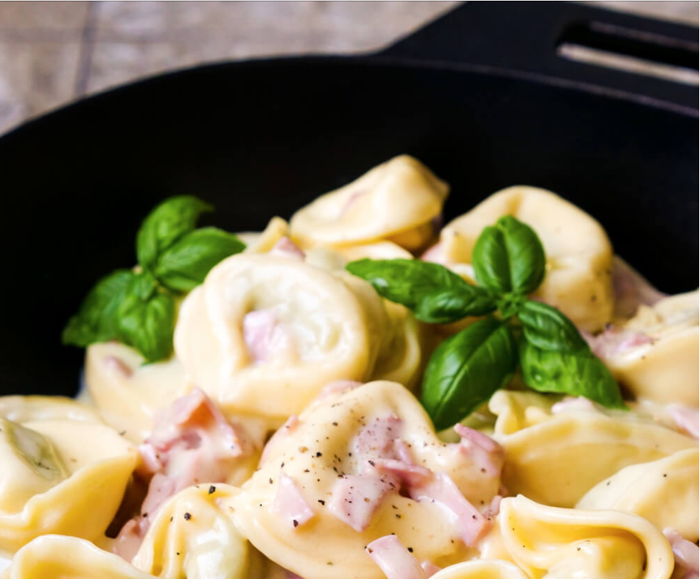

### Zutaten

- 700 g Tortellini - Kühlregal
- 200 g Kochschinken
- 1 EL Butter
- 500 ml Sahne zum Kochen
- 2 Eigelb
- Salz
- Pfeffer
- Muskat
- 50 g geriebener Parmesan

1. Tortellini nach Packungsangabe kochen. 
2. Schinken klein schneiden.
3. Butter in einer Pfanne erhitzen und den Schinken leicht anbraten. Mit der Hälfte der Sahne ablöschen und bei geringer Hitze köcheln lassen.
4. Den Rest der Sahne in einer Schüssel mit dem Eigelb, Parmesan, Salz, Pfeffer und Muskat verrühren.
5. Die Sauce zusammen mit den Tortellini zu dem Schinken in die Pfanne geben.  Alles für ca. 2 Minuten köcheln lassen, bis eine dickflüssige Sauce entsteht.