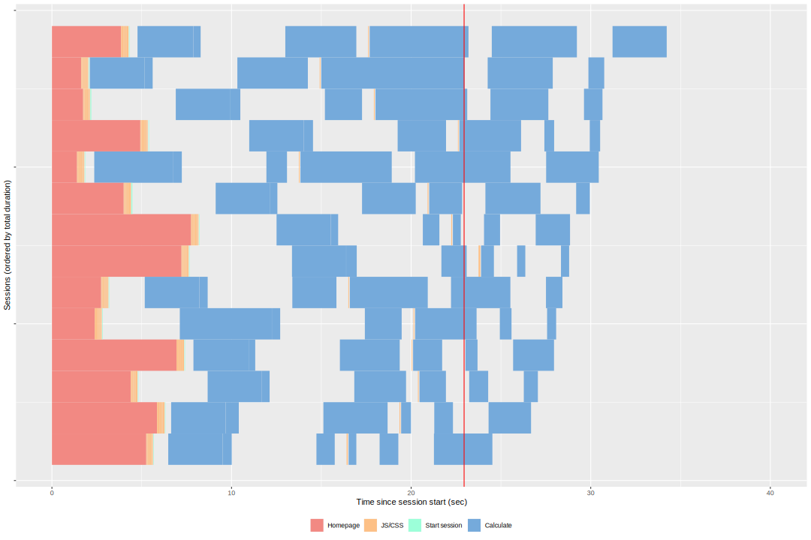

<div style="text-align: center;">

</div><div style="text-align: left;">

</div><div style="text-align: center;">

</div>
## Benchmark it

To get a benchmark report for the app,  the [shinyloadtest](https://rstudio.github.io/shinyloadtest/) package and has three basic steps:

01. Record a typical user session 
```r
shinyloadtest::record_session("http://rstudio.edgar-treischl.de/shiny/power/")
```

02. Simulate your record with multiple simultaneous users and the shinycannon tool.

```bash
shinycannon recording.log http://rstudio.edgar-treischl.de/shiny/power/ 
--workers 5 
--loaded-duration-minutes 2 
--output-dir run1

```

03. Get a report via:
```r
library(shinyloadtest)
df <- load_runs("run1")

shinyloadtest_report(df, "report.html")
```





### Shinycannon
### macOS

1. Install [Java](https://www.java.com/en/download/)
2. Download [shinycannon-1.2.0-85f280d.sh](https://github.com/rstudio/shinycannon/releases/download/v1.2.0-alpha/shinycannon-1.2.0-85f280d.sh)
3. Install with `sudo cp shinycannon-1.2.0-85f280d.sh /usr/local/bin/shinycannon; sudo chmod +x /usr/local/bin/shinycannon`
4. Run `shinycannon -h` to see help output, or `shinycannon [RECORDING-PATH] [APP-URL]` to generate load.


## Use a cache:

Simply pipe either the reactive or render* function that you want to cache:

```r
r <- reactive(slow_function(input$x, input$y)) %>% 
  bindCache(input$x, input$y)

output$text <- renderText(slow_function2(input$z)) %>% 
  bindCache(input$z)
```


Add Sys.Date() to get an update each day: You can do that by adding to the cache key, so that the cache effectively only lasts for a single day. Plus: fortunately the cache has a fixed total size.

```R
%>% bindCache(input$username, Sys.Date())
```
